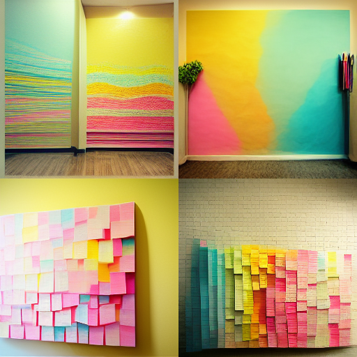

# markdown-test

## Links to sections
- [First Section](#first-section)
- [Later Section](#later-section)

## First Section

  
Table example

| Name | Favorite Food | Number |
| :--- | :----: | ---: |
| Alice | Chicken | 10.00 |
| Bob | Ice cream | 100.00 |

other text

  
second collapsible section

  
1. step
2. another step
3. third step
   * note
   * another note

more text

Lorem ipsum dolor sit amet, consectetur adipiscing elit, sed do eiusmod tempor incididunt ut labore et dolore magna aliqua. Ut enim ad minim veniam, quis nostrud exercitation ullamco laboris nisi ut aliquip ex ea commodo consequat. Duis aute irure dolor in reprehenderit in voluptate velit esse cillum dolore eu fugiat nulla pariatur. Excepteur sint occaecat cupidatat non proident, sunt in culpa qui officia deserunt mollit anim id est laborum.

## Later Section
Hi

Some image

